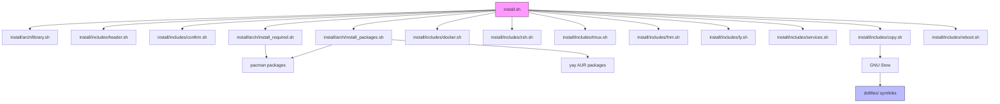

# Project Overview

Personal Arch Linux dotfiles repository with automated setup script for Hyprland-based desktop environment. Provides a complete workflow to install and configure essential packages, shell utilities, window manager, and personal configuration files through GNU Stow.

## Repository Structure

- `install.sh` - Main entry point that orchestrates the entire installation process
- `install/` - Installation scripts and configurations
  - `arch/` - Arch Linux-specific package management helpers
  - `includes/` - Modular setup components (Docker, ZSH, Tmux, Fnm, Ly, services, copy)
- `dotfiles/` - Configuration files managed by GNU Stow
  - `.config/` - Application configurations (Hyprland, Waybar, Zed, Ghostty, etc.)
  - `.zshrc`, `.gtkrc-2.0` - Shell and GTK configuration

## Build & Development Commands

```bash
# Clone repository
git clone https://github.com/Mauladen/dotfiles.git
cd dotfiles

# Run full installation (interactive prompts)
./install.sh

# Manual stow operations (if needed)
cd dotfiles/dotfiles
stow -t ~ .

# Update existing dotfiles
stow -R -t ~ .
```

> TODO: Add commands for testing individual install components

## Code Style & Conventions

- **Shell scripts**: Bash with shebang `#!/bin/bash`
- **Comments**: Russian language comments in scripts
- **Package documentation**: Each package in `install_packages.sh` must have inline comment in Russian explaining its purpose; organize packages into logical groups with blank lines
- **Configuration**: Modular approach - each component in separate sourced file
- **Commit messages**: Free format, English language
- **Stow**: Use GNU Stow for managing symlinks from `dotfiles/` to `~/.config/`

## Architecture Notes



**Components:**

1. **library.sh** - Package management helpers (`_isInstalled`, `_installPackages`, `_installPackagesYay`, `_installYay`)
2. **install_required.sh** - Installs base tools (gum, stow, git) and yay AUR helper
3. **install_packages.sh** - Installs full package list (desktop environment, utilities, fonts, apps)
4. **Component includes** - Optional interactive setup for Docker, ZSH, Tmux, Fnm, Ly
5. **services.sh** - Enables NetworkManager and bluetooth services
6. **copy.sh** - Uses GNU Stow to symlink dotfiles from `dotfiles/` to home directory

**Data Flow:**

1. User runs `install.sh`
2. Script sources helper functions
3. Displays header and confirmation prompt (gum)
4. Installs required packages and yay
5. Installs full package list (pacman + AUR)
6. Runs optional component setups
7. Enables system services
8. Stows dotfiles
9. Prompts for reboot

## Testing Strategy

> TODO: No testing framework currently defined

**Manual Testing:**

```bash
# Verify stow operation
ls -la ~/.config/hyprland  # Should be symlinked
ls -la ~/.config/zshrc     # Should be symlinked

# Check installed packages
pacman -Qs hyprland
pacman -Qs zsh
pacman -Qs docker

# Verify services
systemctl status NetworkManager
systemctl status bluetooth
```

> TODO: Add CI/CD pipeline for testing installation on fresh Arch VM

## Security & Compliance

- **Secrets handling**: No secrets stored in repository
- **Dependency scanning**: Manual review via pacman/yay package management
- **Package sources**: Official Arch repositories + AUR (reviewed packages)
- **Privilege escalation**: Uses sudo for package installation and service management
- **License**: Personal dotfiles repository

> TODO: Add automated dependency vulnerability scanning

## Agent Guardrails

- **Files never touched**: User data directories, system-critical configs outside scope
- **Required reviews**: All changes to install scripts must be reviewed manually
- **Rate limits**: None defined
- **Modifications**: Do not modify existing user configurations without explicit approval
- **Package changes**: Verify package compatibility before adding to lists
- **Service management**: Only enable/disable services explicitly defined in `services.sh`

## Extensibility Hooks

- **Environment variables**: None currently used
- **Component toggles**: Each `includes/` script can be commented out in `install.sh`
- **Package lists**: Modify `packages` array in `install/arch/install_packages.sh`
- **AUR packages**: Modify `packages_aur` array in `install/arch/install_packages.sh`
- **New components**: Add new script to `install/includes/` and source in `install.sh`
- **Dotfiles**: Add configs to `dotfiles/` and stow will create symlinks

## Further Reading

> TODO: Add detailed documentation links when created

- **Arch Wiki**: https://wiki.archlinux.org/
- **Hyprland Wiki**: https://wiki.hyprland.org/
- **GNU Stow**: https://www.gnu.org/software/stow/
- **Zsh plugins**: zsh-completions, zsh-autocomplete, zsh-autosuggestions, zsh-syntax-highlighting, fast-syntax-highlighting
